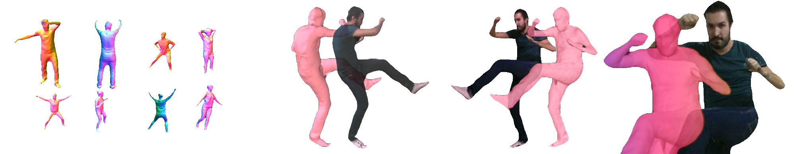
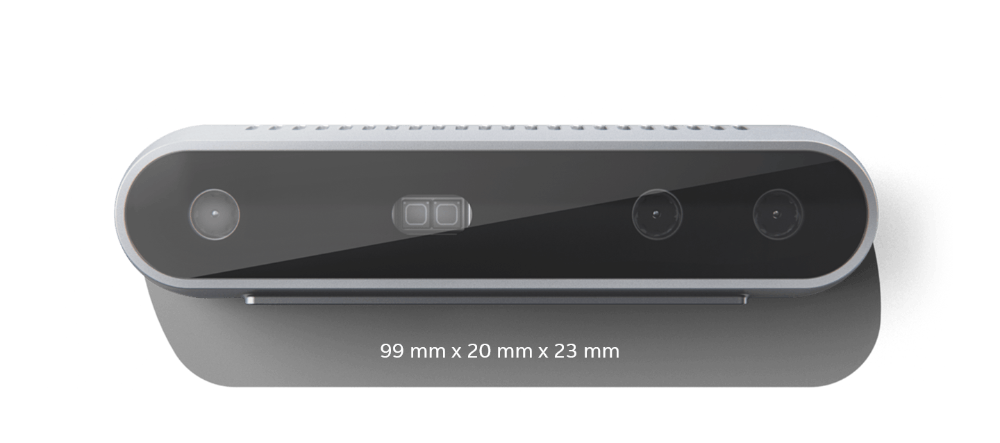
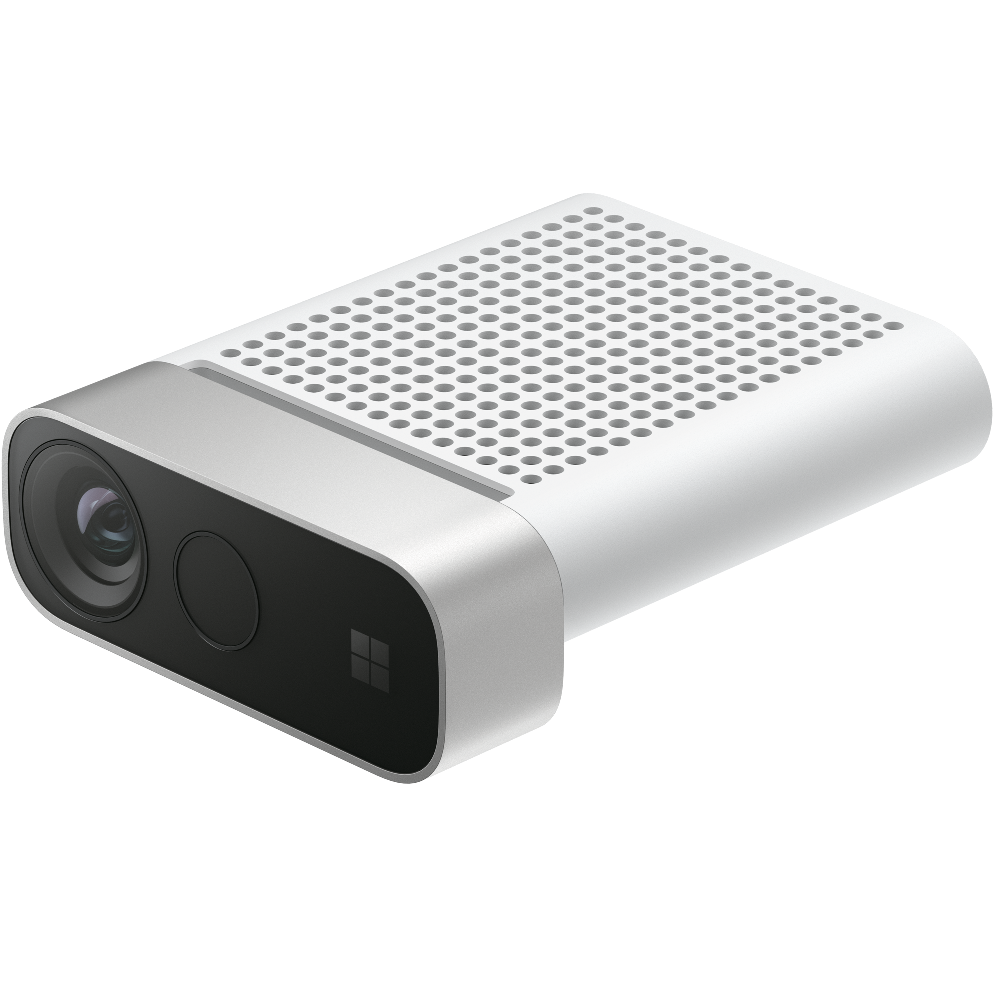
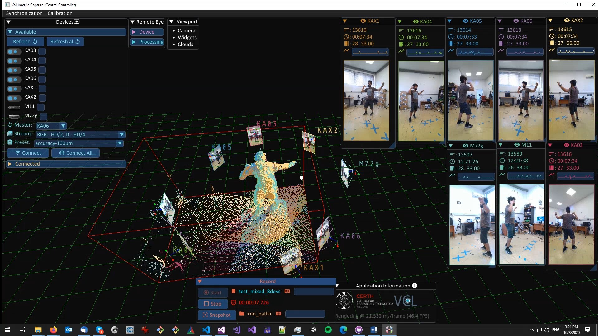

# A Portable, Flexible and Facile Volumetric Capture System

> Moving beyond green screens as well as stationary, expensive and hard to use setups  

[](https://vcl3d.github.io/VolumetricCapture/)
[]()
[](https://arxiv.org/pdf/1909.01207.pdf)

[](https://vcl3d.github.io/StructureNet/)
[](http://ieeevr.org/2020/)
[](https://arxiv.org/pdf/2003.10176.pdf)
[]()
[](https://www.iti.gr/iti/files/document/publications/S05-Markerless%20Structure-based%20Calibration.pdf)

[](https://vcl.iti.gr/dataset/human4d/)
[](https://ieeexplore.ieee.org/xpl/RecentIssue.jsp?punumber=6287639)
[](https://ieeexplore.ieee.org/document/9204617)

_______


_______

# Documentation
[](https://vcl3d.github.io/VolumetricCapture/)

Updated documentation with assembly instructions, installation guides, examples and more are now available at the project's page: https://vcl3d.github.io/VolumetricCapture/.

> As volumetric capture requires the deployment of a complex system spanning multiple hardware and distributed software, please refer to the [online documentation](https://vcl3d.github.io/VolumetricCapture/) first, and then the [closed issues](https://github.com/VCL3D/VolumetricCapture/issues?q=is%3Aissue+is%3Aclosed) as most problems would have been addressed there.

# News
The latest release supporting both Kinect 4 Azure and Intel RealSense 2.0 D415 is now available for [download](https://github.com/VCL3D/VolumetricCapture/releases/tag/5.0.0) with various fixes and feedback integrated.
It comes with an improved multi-sensor calibration that allows for greater flexibility in terms of sensor numbers and placement and higher accuracy.
More information can be found [here](https://vcl3d.github.io/StructureNet/) __\[[8](#StructureNet)\]__.

_______
## Overview

This repository contains [VCL](https://vcl.iti.gr)'s evolving toolset for volumetric (multi-RGB-D sensor) capturing and recording, initially presented in __\[[1](#VolCap)\]__.
It is a research oriented, but flexible and optimized, software with integrated multi-sensor alignment research results (__\[[6](#Markerless)\]__, __\[[8](#StructureNet)\]__), that can be / has been used in the context of:

* Live Tele-presence __\[[2](#Integrated)\]__ in [Augmented VR](https://www.youtube.com/watch?v=7O_TrhtmP5Q) or Mixed/Augmented Reality settings
* Performance Capture __\[[3](#PerfCap)\]__
* Free Viewpoint Video (FVV)
* Immersive Applications (_i.e._ [events](https://www.youtube.com/watch?v=J3zJmMNxV0k) and/or [gaming](https://www.youtube.com/watch?v=nK7pC41YjZY)) __\[[4](#Platform)\]__
* Motion Capture __\[[5](#DeepMoCap)\]__
* Post-production __\[[9](#XR360)\]__
* Data Collection __\[[7](#Denoising)\]__, __\[[10](#HUMAN4D)\]__

## Design

The toolset is designed as a distributed system where a number of processing units each manage and collect data from a single sensor using a headless application.
A set of sensors is orchestrated by a centralized UI application that is also the delivery point of the connected sensor streams.
Communication is handled by a broker, typically co-hosted with the controlling application, although not necessary.

## Sensors

We now support both (and mixed !) [Intel RealSense D415](https://www.intelrealsense.com/) and [Azure Kinect DK](https://azure.microsoft.com/en-in/services/kinect-dk/) sensors.

| Intel RealSense D415  |  Microsoft Kinect Azure |
|:-------------------------:|:-------------------------:|
|  |  |

_______

## Highlights

* Multi-sensor streaming and recording
* Quick and easy volumetric sensor alignment
* Hardware and software (IEEE 1588 PTP) synchronization



## Download

Check our latest [releases](https://github.com/VCL3D/VolumetricCapture/releases).

## Citation

If you used the system or found this work useful, please cite:
```
@inproceedings{sterzentsenko2018low,
  title={A low-cost, flexible and portable volumetric capturing system},
  author={Sterzentsenko, Vladimiros and Karakottas, Antonis and Papachristou, Alexandros and Zioulis, Nikolaos and Doumanoglou, Alexandros and Zarpalas, Dimitrios and Daras, Petros},
  booktitle={2018 14th International Conference on Signal-Image Technology \& Internet-Based Systems (SITIS)},
  pages={200--207},
  year={2018},
  organization={IEEE}
}
```

## Caveats
We currently only ship binaries for the Windows platform, supporting Windows 10.

# References
<a name="VolCap"/> __\[1\]__ Sterzentsenko, V., Karakottas, A., Papachristou, A., Zioulis, N., Doumanoglou, A., Zarpalas, D. and Daras, P., 2018, November. [A low-cost, flexible and portable volumetric capturing system](https://www.iti.gr/iti/files/document/publications/low-cost-flexible.pdf). In 2018 14th International Conference on Signal-Image Technology & Internet-Based Systems (SITIS) (pp. 200-207). IEEE.

<a name="Integrated"/> __\[2\]__ Alexiadis, D.S., Chatzitofis, A., Zioulis, N., Zoidi, O., Louizis, G., Zarpalas, D. and Daras, P., 2016. [An integrated platform for live 3D human reconstruction and motion capturing](https://arxiv.org/ftp/arxiv/papers/1712/1712.03084.pdf). IEEE Transactions on Circuits and Systems for Video Technology (TCSVT), 27(4), pp.798-813.

<a name="PerfCap"/> __\[3\]__ Alexiadis, D.S., Zioulis, N., Zarpalas, D. and Daras, P., 2018. [Fast deformable model-based human performance capture and FVV using consumer-grade RGB-D sensors](https://www.iti.gr/iti/files/document/publications/RGB-D_09-03-2018.pdf). Pattern Recognition (PR), 79, pp.260-278.

<a name="Platform"/> __\[4\]__ Zioulis, N., Alexiadis, D., Doumanoglou, A., Louizis, G., Apostolakis, K., Zarpalas, D. and Daras, P., 2016, September. [3D tele-immersion platform for interactive immersive experiences between remote users](https://www.iti.gr/iti/files/document/publications/cameraReady.pdf). In 2016 IEEE International Conference on Image Processing (ICIP) (pp. 365-369). IEEE.

<a name="DeepMoCap"/> __\[5\]__ Chatzitofis, A., Zarpalas, D., Kollias, S. and Daras, P., 2019. [DeepMoCap: Deep Optical Motion Capture Using Multiple Depth Sensors and Retro-Reflectors](https://www.mdpi.com/1424-8220/19/2/282). Sensors, 19(2), p.282.

<a name="Markerless"/> __\[6\]__ Papachristou, A., Zioulis, N., Zarpalas, D., and Daras, P., 2018. [Markerless structure-based multi-sensor calibration for free viewpoint video capture](https://www.iti.gr/iti/files/document/publications/S05-Markerless%20Structure-based%20Calibration.pdf), International Conference on Computer Graphics, Visualization and Computer Vision (WSCG).

<a name="Denoising"/> __\[7\]__ Sterzentsenko V., Saroglou L., Chatzitofis A., Thermos S., Zioulis N., Doumanoglou A., Zarpalas D., Daras P., 2019. [Self-Supervised Deep Depth Denoising](https://www.iti.gr/iti/files/document/publications/190901193b.pdf), International Conference on Computer Vision (ICCV)

<a name="StructureNet"/> __\[8\]__ Sterzentsenko V., Doumanoglou, A., Thermos S., Zioulis N., Zarpalas D., Daras P., 2020. [Deep Soft Procrustes for Markerless Volumetric Sensor Alignment](https://arxiv.org/pdf/2003.10176.pdf), IEEE Conference on Virtual Reality and 3D User Interfaces (VR)

<a name="XR360"/> __\[9\]__ Karakottas, A., Zioulis, N., Doumanglou, A., Sterzentsenko, V., Gkitsas, V., Zarpalas, D. and Daras, P., 2020, July. [XR360: A Toolkit for Mixed 360 and 3d Productions](https://www.iti.gr/iti/files/document/publications/ICME2020_XRWorkshop.pdf). In 2020 IEEE International Conference on Multimedia & Expo Workshops (ICMEW) (pp. 1-6). IEEE.

<a name="HUMAN4D"/> __\[10\]__ Chatzitofis A., Saroglou, L., Boutis P., Drakoulis P., Zioulis N., Subramanyam S., Kevelham B., Charbonnier C., Cesar P., Zarpalas D., Kollias S., Daras P., 2020. [HUMAN4D: A Human-Centric Multimodal Dataset for Motions & Immersive Media](https://ieeexplore.ieee.org/iel7/6287639/8948470/09204617.pdf), IEEE Access Journal
