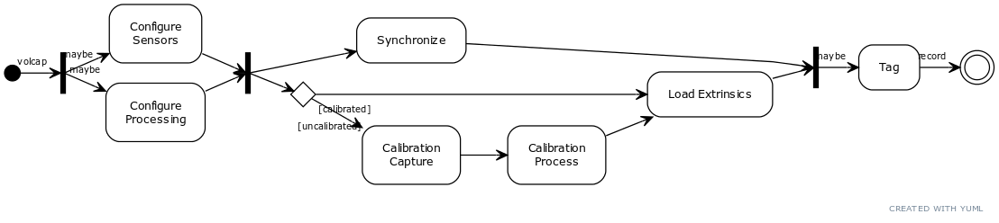

# Data Recording
**TODO**
{: .label .label-red }

<!--
* Volumetric Capturing - 4 k4as - issues [Fail to stream with Kinect Azure #25](https://github.com/VCL3D/VolumetricCapture/issues/25)
* Volumetric Capturing - 6 k4as
* Volumetric Capturing - 3 K4as - (pay attention to setups in issue [Calibration Fails #29](https://github.com/VCL3D/VolumetricCapture/issues/29) / [Bad/Inconsistent Framerate with Three Kinects #30](https://github.com/VCL3D/VolumetricCapture/issues/30)
* Volumetric Capturing - Mixed devices (both kinect and realsense)
* Volumetric Capturing - Modifying Depth Units issue [Crash When Changing Depth Units Value #31](https://github.com/VCL3D/VolumetricCapture/issues/31)
* Volumetric Capture - Remote Eye on the same PC  - issue [Azure Kinect mis-identified as Intel camera #22](https://github.com/VCL3D/VolumetricCapture/issues/22)
* Showcase NUC LEDs at each step !!
-->

# Recording Extraction
After the recording session is completed (as described above), the user can save data from distrinct frames of each recorded file (furtherly described in [VolSnap Tool](../volsnap)). User can save _depth_ and _color_ data (undistorted if such option is selected before exporting starts), _pointclouds_ with and without color per vertex (again, pointclouds will be undistorted if such option is enabled) and at last if calibration option is selected, pointclouds with be saved in a global coordinate system.
Once exporting is complete, output directory should look similar to

      

 
depending on the exporting options selected.

These folders contain the corresponding data, with the _groupID_, _deviceName_ and _frameID_ contained in the filename.

      
      
      

 

_Color_, _Depth_ and _Pontcloud_ data from the first group for a recording.

_Depth_ images can be previewed any program supporting *pgm* file format visualization (we use [InfranView](https://www.irfanview.com/)) and _Pointclouds_ can be shown by any 3D visualization program (we use [Meshlab](https://www.meshlab.net/)).

Here we show the **calibrated** merged views of **colored** _Pointclouds_, as exported by our software.

 

**TODO**
{: .label .label-red }
