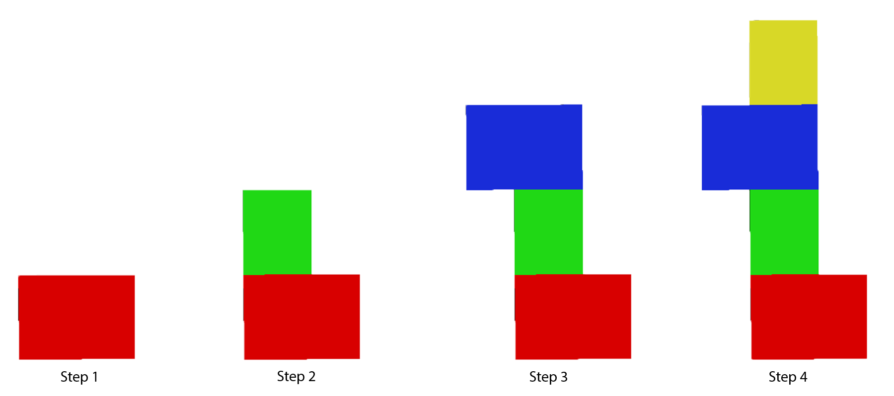
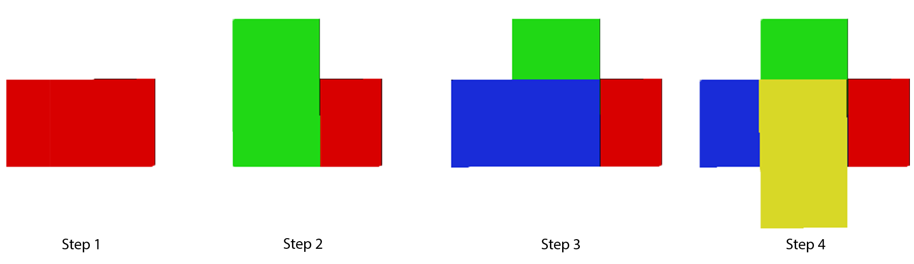

# Assembling the Calibration Structure

The Volumetric Capture calibration structure requires `4` low-cost and commercially available packaging boxes from the IKEA, and specifically the [JÄTTENE boxes](https://www.ikea.com/ie/en/products/small-storage-organisers/storage-boxes-baskets/j%C3%A4ttene-packaging-box-brown-art-60047151/). 
In practice, the calibration structure could be assembled using any `4` boxes, sized 56 x 33 x 41 cm each.
With this easily-assembled reference structure we ensure a facile calibration procedure that can be used with minimal technical knowledge.
Optionally, [random noise pattern](../../assets/images/whitenoisepattern.png) could be glued onto the calibration boxes in order to improve the quality of the acquired depth measurements.

Since the proposed calibration structure does not require markers, users should only pay attention in placing the boxes, one on top of each other following a 90o rotational pattern, as depicted in the following pictures. 
Snapping is performed using each respective bottom boxes sides.
The first image shows the assembling procedure from a diagonal perspective. For more descriptive design we use color-coded representation. 
The first (bottom-most) box is colored in red, the second in green, the third in blue while the last (top-most) is depicted in yellow. 

---
The succeeding image displays the identical positioning of the boxes as viewed from the front-view.

---

And this last image depicts the corresponding calibration procedure from the top-view.

---