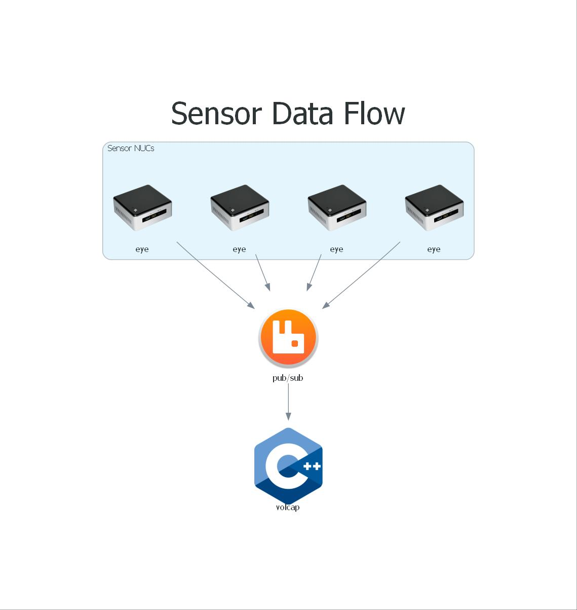
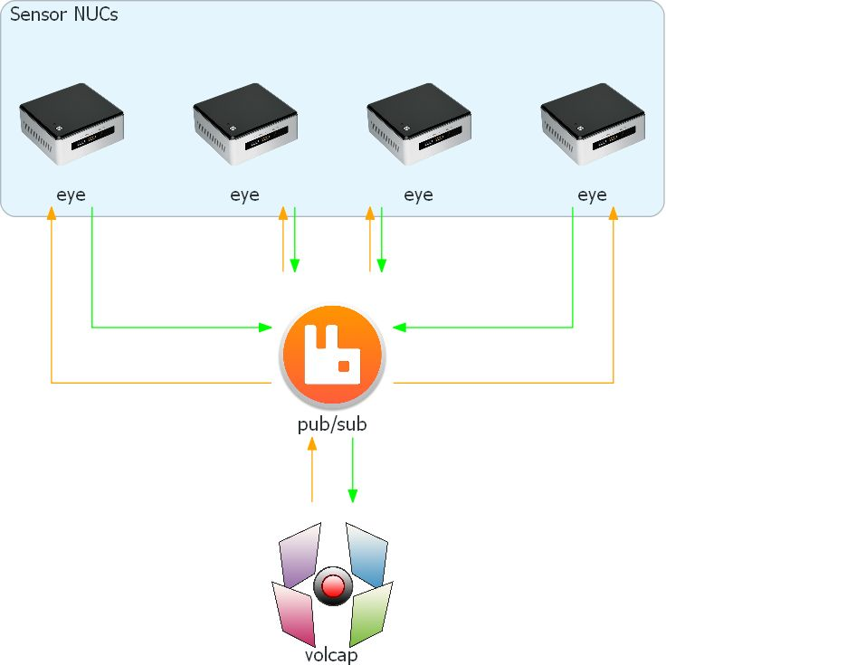
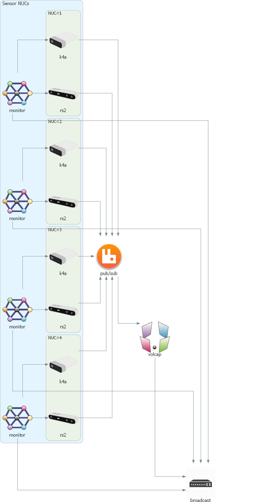

# The Distributed Remote Eye Application

The **Eye** is a sensor specific headless command line application that connects to the sensor, and to the broker.
Through specific communication channels it streams the sensor acquired data to the broker and receives configuration commands.
In addition, it also performs software synchronization with the **VolCap** application running on the workstation.

They currently come in two versions:
- `remote_eye_k4a.exe`: The Microsoft Kinect 4 Azure variant
- `remote_eye_rs2.exe`: The Intel RealSense 2.0 D415 variant

It is also supported by a monitoring service, and an Intel NUC LED controller application (see [Software Setup](../software)).

The **eyes** are distributed on sensor processing nodes (_e.g._ Intel NUCs for a highly portable setup) and serve sensor acquired data in an isolated manner (_except for when HW triggering is used_).



Their parameterization is also facilitated through messages initiated by **VolCap**, with the **Eyes** acknowledging and replying with the result.
This ensures a consistent state between the sensor nodes (**Eyes**) and the central GUI (**VolCap**).



## Automatic Sensor Connection

The monitoring service is responsible for automatic the sensor connection workflow.
It is signaled every time **VolCap** starts, or everytime the `Refresh All` or `Refresh` buttons are pressed (_with the latter corresponding refreshing only the selected devices_).
It then manages the lifetime of the **Eye** application by killing and (re-)spawning it.
It additonally selects the appropriate sensor specific executable by polling the sensor processing unit's connected `USB3.0` devices.
The **Eyes** then send a handshake message on the broker, through which they are made available for connection to **VolCap**.



## Manual Sensor Connection

In the case that automatic connection is not available, the **Eyes** can be connected manually via their command line interface:

```yaml
Remote Eye: a Remote Viewpoint Streamer Command Line Interface
Usage: remote_eye_{k4a|rs2}.exe [OPTIONS]

Options:
  -h,--help                                     Print this help message and exit
  --address TEXT                                Broker's IP address
  --port INT=5672                               Broker's connection port
  --user TEXT=volumetric                        Broker's connection username
  --pass TEXT=capture                           Broker's connection password
  --config TEXT=default.json                    Local configuration file
  --work_dir TEXT                               Working directory
  --log_file TEXT                               Local log file
  -v,--verbose                                  Verbose flag
```

Only this time, only the broker's username and password are already configured to the default values, and instead the broker's IP needs to be offered.

It used to be that when running an **Eye** together with **VolCap** there would be a port conflict and it would crash. This is not the case anymore and thus, an **Eye** can be hosted on the same workstation that **VolCap** runs.
{: .label .label-purple }

## Troubleshooting

> Some of the issues related to connectivity and/or sensor streaming are due to USB driver issues and clean up.
Experience shows that when a device does not come up automatically, or no streams arrive after connecting it, a manual USB cable plug and re-plug to another USB controller resolves the issue.
Switching USB controller is hardware specific, but for Intel NUCs, switching between the front and back USB ports usually accomplishes it.

> To use the Intel NUC LED controller, you need to first run it once the `{remote_eye_k4a|rs2}_eye.exe` manually to connect it to `volcap.exe`. Then once the `intel_nuc_led_utils.exe` is triggered a Windows pop up will come up and request approval. Once this is performed, it will never ask it again, even when run from the `remote_eye_service`.

> If when connecting the **Eyes** through **VolCap** results in connection error and the monitoring service stops check the `remote_eye_service.log` of that mini-PC in `C:/Capturer/bin`. If the last log is the following:
```
Exception: System.ComponentModel.Win32Exception: Access is denied.
System.Diagnostics.Process.Kill()
remote_eye_service.UDPListener.Listen()
```
You should open the Windows `Task Manager`, go to `Services` Tab and find the `remote_eye_service`. Right-click on it and select `Open-Services`. Find again the `remote_eye_service`, right-click on it and select `Properties`. Go to `Log On` tab and check the `Interact with Desktop` option. 

<p align="center">
    
</p>

> Additionally, you should go to `C:/Capturer/remote_eye_service` directory in the mini-PC, right-click the `remote_eye_service.exe` and select `Properties`. Go to `Compatibility` tab, check the `Run as administrator` option at the end and restart the mini-PC.

<p align="center">
    
</p>

This list is a work-in-progress and will be updated as more issues are identified and resolved.
{: .label .label-yellow }