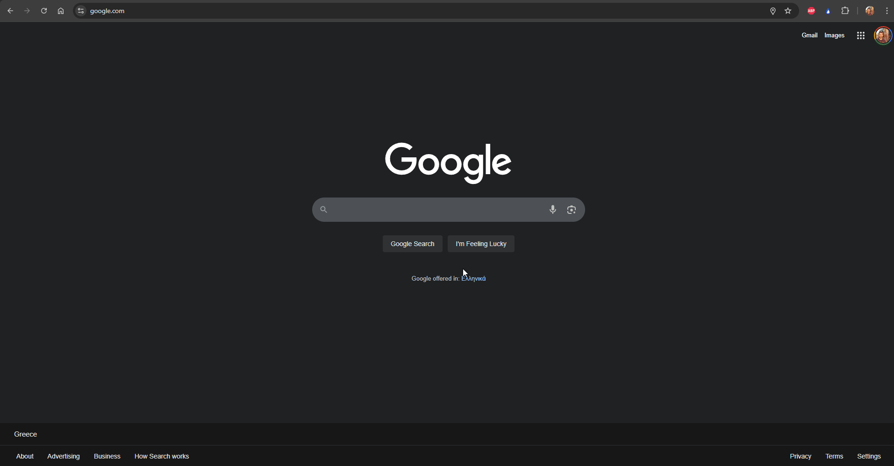
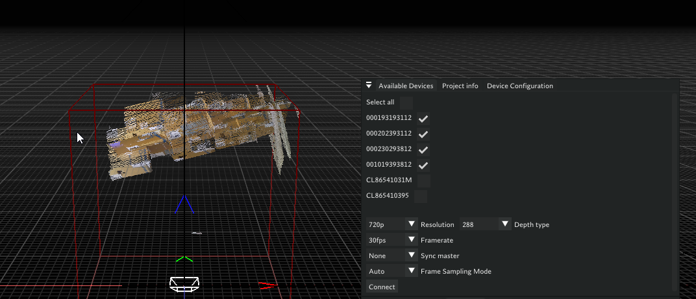
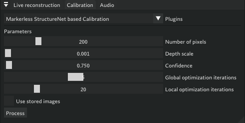
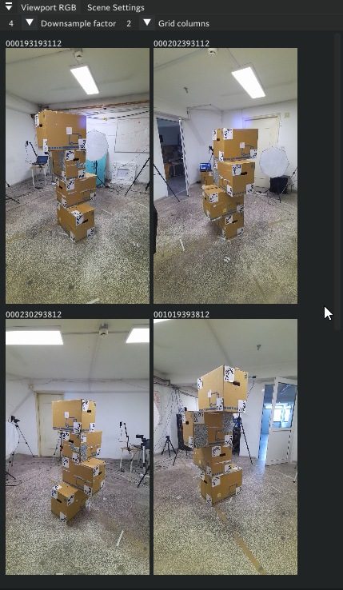
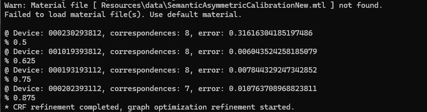
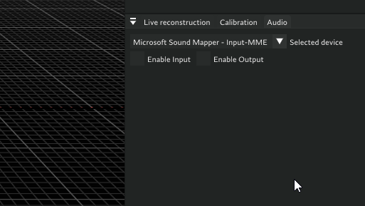

# Volumetric Capture Application: Dual Setup Guide

This guide explains how to set up and run **two Volcap applications in parallel**, receive both streams, and visualize them in a single Unity scene with audio streaming.

## Table of Contents

1. [Hardware Requirements](#hardware-requirements)
2. [Network & Infrastructure Preparation](#network--infrastructure-preparation)
3. [RabbitMQ Installation & Configuration](#rabbitmq-installation--configuration)
4. [Volcap Installation](#volcap-installation)
5. [Remote Camera Machine Setup](#remote-camera-machine-setup)
6. [Unity Project Setup](#unity-project-setup)
7. [Camera Connection](#camera-connection)
8. [Calibration Process](#calibration-process)
9. [Audio Setup](#audio-setup)
10. [Reconstruction Workflow](#reconstruction-workflow)
11. [Unity Streaming & Visualization](#unity-streaming--visualization)
12. [Troubleshooting & Best Practices](#troubleshooting--best-practices)
13. [Double Setup Checklist](#double-setup-checklist)

## Hardware Requirements

- **2 Volcap Machines**
  - Each runs one Volcap application
  - Both require GPU and CUDA installation (tested with version 12.7)
  - One of these machines or any other machine on the same network can host the RabbitMQ server

- **Cameras**
  - **Recommended:** 4 cameras per Volcap setup
  - One camera per remote machine
  - 4 cameras are easier to calibrate with our box calibration algorithm than 3 cameras
  - 3 cameras will have blind spots when capturing a human
  - Camera machines do not need GPU or specific requirements
  - Compatible with both Orbbec and Kinect Azure cameras

- **RabbitMQ Server Machine**
  - Should be a desktop (not laptop) due to higher bandwidth requirements
  - Requires relatively good CPU (we used i7-13700 without issues)
  - If CPU is less powerful, RabbitMQ server will not be able to process data

- **Networking Equipment**
  - 1 network switch to handle all machines
  - Multiple Ethernet cables to connect everything

## Network & Infrastructure Preparation

- **Identify IPs** to all machines for easier use.
- **Connect all devices** to the switch and ensure they’re on the same subnet.
- **Test network connectivity** with `ping` between all machines.
- **Disable unused network adapters** to avoid routing issues.

## RabbitMQ Installation

### Step 1: Install Prerequisites
1. **Install Erlang**
   - Download from: https://www.erlang.org/downloads

2. **Install RabbitMQ**
   - Download from: https://www.rabbitmq.com/docs/download

### Step 2: Enable Management Plugin
1. Open RabbitMQ command prompt (search in Windows Start menu)
2. Run the following command:
rabbitmq-plugins enable rabbitmq_management

### Step 3: Configure RabbitMQ
1. Navigate to `localhost:15672` in your browser
2. If the page doesn't load, restart RabbitMQ from Windows Start menu
3. Login with default credentials: `guest` / `guest`
4. Go to **Admin** tab → **Add User**
5. Create your username and password (these will be used in following steps)
6. Assign admin privileges to the new user
7. Click on the new user → **Set Permissions** on virtual host
8. Log out and log in again with your new credentials



### Step 4: Set Firewall Rules

- Open Windows Defender Firewall → Advanced Settings.
- Add **inbound and outbound rules** for ports:
- **5672** (RabbitMQ AMQP, for remote use)
- **11234** (automatic Volcap camera discovery)
- **15672** (RabbitMQ management, outbound only)
- Only one network adapter should be enabled (the Ethernet one). You can check this on Network Connections

1. In the left panel of the window that poped-up select Inbound Rules
2. In the right panel that appeard select New Rule...
3. In the window that appeared select Port and hit Next
4. In Specific local ports text box type 5672 and hit next
5. In the next window leave the Allow Connection option selected and hit next
6. In the next window leave everything selected and hit next
7. In the next window you can add a name for the rule and a description, so as to know that you created that rule, and it’s not a Windows default rule.
Repeat all the steps in order to create an Outbound Rule too.


## Volcap Installation

### Prerequisites
- CUDA installation is required and must be added to system PATH

### Installation Steps
1. **Extract Volcap**
- Unzip the compressed folder
- Copy to a directory that doesn't require administrative privileges (e.g., Documents)
- **Do NOT** copy to Program Files

2. **Run Volcap**
- Open command prompt in the Volcap folder
- Run with the following command:
volcap.exe --local_ip <your_local_ip> --broker_ip <rabbitmq_server_ip> --broker_username <username> --broker_password <password>

### Parameter Explanation
- `--local_ip`: Your local machine IP
- `--broker_ip`: IP address of the machine running RabbitMQ
- `--broker_username` and `--broker_password`: Credentials created during RabbitMQ setup
- `--broadcast`: Only use when running 1 Volcap application (auto-discovers cameras but incompatible with dual setup)

## Remote Machine Installation

1. **Install RemoteEye**
- Unzip and install on each remote camera machine
- Copy `device_plugins` folder and `remote_eye_k4a.exe` to:
  ```
  C:\Program Files (x86)\RemoteEye\RemoteEye
  ```

2. **Verify Service**
- Check Windows Task Manager → Services tab
- Ensure `remote_eye_listener_service` is running
- This is only important when using the `--broadcast` flag

3. **Connect Cameras**
- Plug in cameras (supports both Orbbec and Kinect Azure)

## Unity Setup

1. **Create New Project**
- Open Unity and create a new 3D project with built-in renderer

2. **Import Package**
- Go to **Assets** → **Import Package**
- Select the Unity package and import all

3. **Configure Scene**
- Load the main scene
- Find 2 `DLLCaller` GameObjects
- If testing only 1 Volcap stream, disable `DLLCaller1`
- Set RabbitMQ server IP and credentials on both GameObjects

## Camera Connection

### Option 1: Auto-Discovery (Single Volcap Only)
- Run Volcap with `--broadcast` flag
- If remote machines are properly set up, all available cameras appear in Volcap UI
- Select all cameras and press **Connect**

### Option 2: Manual Connection (Recommended for Dual Setup)
Run this command on each remote machine:
- cd "C:\Program Files (x86)\RemoteEye\RemoteEye"
- remote_eye_k4a.exe --address <rabbitmq_server_ip> --user <username> --pass <password> --port 5672

**Parameter Details:**
- `--address`: RabbitMQ server IP address
- `--user` and `--pass`: RabbitMQ credentials from setup
- `--port`: Should be 5672

After running these commands, cameras should appear in the Volcap available devices widget, select all and connect.

After successful connection you should be seeing pointclouds on the volcap scene.



## Calibration Instructions



### Initial Calibration
1. **Start Calibration Process**
   - Go to calibration widget in Volcap
   - If parameters load correctly, press **Process** to start calibration
   - Monitor command prompt for errors
   - Final error per camera should be **≤ 0.02 meters**
   - When calibration process finishes, then you need to save calibration , restart volcap, connect cameras and open the saved project, instruction below (known bug)

2. **Calibration Setup Tips**
   - Place calibration boxes at the center of the scene
   - All cameras should look at boxes in center of view (check viewport widget)
   - Boxes should not be too close to image edges
   - **Ideal setup:** Cameras 1.5+ meters away, boxes occupy 60% of image height with 20% margins top/bottom
   - Each camera should see 2 sides of the boxes
   - Ensure correct box structure orientation



### Save and Load Calibration
1. **Save Calibration**
   - After successful calibration: **File** → **Save Project As**
   - This creates a `.volcap` file storing calibration data
   - Reuse this file if cameras aren't moved

2. **Load and Verify Calibration**
   - Restart Volcap
   - Connect cameras
   - **File** → **Open Project** → load saved `.volcap` file
   - Press **Connect** on available cameras to see calibration in viewer

### Calibration Adjustment
1. **Z-axis Correction** (known bug)
   - Go to calibration editing widget
   - Ensure **ALL** is selected at top
   - Use **+** sign on `tz` to raise cameras
   - Use **-** sign for small downward adjustments
   - Stop when floor is slightly visible in Volcap viewer
   - Save project after adjustments

2. **Troubleshooting**

   Calibration Example

   Below is an example of a calibration process. In this case, you can observe that one of the cameras—specifically the one with serial number 2300293812—shows a calibration error greater than 0.02. Such a high error indicates that the calibration for this camera is not accurate.

   

   The following animation demonstrates the impact of inaccurate calibration. Notice that the point cloud rendered in blue is misaligned; this corresponds to the camera with serial number 2300293812 identified earlier as having a high error.

   

   This visual discrepancy confirms that the calibration for this camera is incorrect and should be addressed to ensure overall system accuracy.

   - If calibration is off, slightly move cameras or boxes, or lower the faulty camera
   - Sometimes rotating boxes 5 degrees fixes issues
   - Check command prompt or Volcap viewer for specific camera errors
   - Redo calibration process
   - This process requires some trial and error to get it right, but once the calibration is correct, then you do not have to do the calibration.

## Audio Setup

1. **Hardware Setup**
   - Connect microphone to computer
   - Compatible with webcam microphones and separate microphones

   

2. **Audio Configuration**
   - Note microphone name in Windows sound settings
   - In Volcap audio widget, select microphone from dropdown
   - Multiple driver entries may appear; first iteration is usually correct

3. **Audio Testing**
   - Make sure that all cameras have been connected, some times camera connections takes 4-5 seconds
   - Select audio source
   - Press **Enable Input** to see live audio graph
   - Make sounds to confirm input from the graph
   - To switch sources, re-enable "Enable Audio" checkbox after selection

## Reconstruction Instructions

### Setup Reconstruction
1. **Verify Plugin Loading**
   - Check live reconstruction widget
   - Plugin name should appear in dropdown with Start/Stop buttons
   - If not loading, check file paths

2. **Start Reconstruction**
   - Ensure cameras are connected and calibration is loaded
   - Press **Start** in live reconstruction widget
   - This creates separate thread from main Volcap thread

### Configure Scene Settings
1. **Bounding Box Adjustment**
   - Use scene settings widget sliders
   - Crop out floor on lower Z-axis for accurate reconstruction

2. **Enable Filtering**
   - In filtering widget, check erosion depth filter

3. **Preview**
   - Stream data to Unity for reconstruction visualization (Streaming workflow)


## Unity Streaming Setup

### Scene Configuration
1. **GameObject Setup**
   - Enable `DLLCaller0` for single stream
   - Enable both `DLLCaller0` and `DLLCaller1` for dual streams
   - Ensure correct IP addresses and credentials are set

2. **Starting Sequence**
   - Start Unity scene after opening 1 or 2 Volcap applications
   - **Important:** Restart Unity editor between sessions to avoid crashes

## Streaming Workflow

### Prerequisites Checklist
Before streaming, ensure you have completed:
1. ✅ Load project
2. ✅ Connect cameras
3. ✅ Select and enable audio source
4. ✅ Start reconstruction
5. ✅ Crop floor
6. ✅ Enable erosion filter
7. ✅ Start Unity scene

### Start Streaming
1. In Volcap, go to **Volumetric Transmission** widget
2. Press **Send Parameters**
3. Press **Start Streaming**

**Result:** Unity should render reconstruction and play audio. Audio may be choppy depending on network and FPS but should remain audible.


### Troubleshooting
- If any step fails, restart the process.
- Closing Volcap when reconstruction is not running clears RabbitMQ.
- To clear RabbitMQ manually, restart the service from Windows with rabbitmq service start/stop

## Improving Reconstruction

### Real-time Calibration Adjustment
- Use Unity to visually verify calibration quality
- Adjust camera rotation/translation in Volcap’s calibration editing widget and see changes live in Unity
- See real-time changes in Unity

### Reconstruction Parameters
After starting reconstruction, adjust these key parameters:

- **iso-level-adjust**: Make only small changes
- **dipole sum radius**: May need to lower
- **num neighbors**: Increase value
- **knn radius**: Decrease value

These parameters should make subtle improvements to reconstruction quality.

**Note:** This setup requires careful attention to calibration and network configuration. Save project files after successful calibration for easier recovery and reuse.

## Double Setup Checklist

1. **Clear RabbitMQ** (see above methods).
2. **Calibrate both setups** and save project files.
3. **Open both Volcap applications**:
 - Send cameras
 - Open project
 - Connect cameras
 - Select and enable audio input
 - Start reconstruction
 - Adjust bounding box and crop floor
 - Enable erosion filter
4. **Open Unity scene and start it**.
5. **On both Volcaps**, press **Send Device Parameters** and **Start Streaming** in the Volumetric Transmission widget.

---

**Tip:**  
Take your time with calibration and network setup. Once correctly configured, the workflow becomes much smoother. Always back up your calibration files and document your network configuration for future reference.
