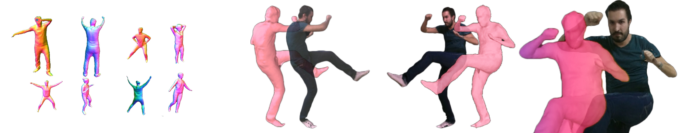

> Moving beyond green screens, expensive, bulky and effort-heavy volumetric setups

___

Volumetric Capture is a multi-sensor (volumetric) capturing system that is:
- Built to use low-cost commodity hardware
- Quick to setup by offering automatic and scalable sensor connectivity
- Easy to deploy due to a markerless and facile volumetric calibration
- Supported via an organized documentatation

# Summary
The toolset is designed as a distributed system where a number of processing units each manage and collect data from a single sensor using a headless application, a **remote eye** (see [Remote Eyes](docs/eyes.md)). 
A set of sensors is orchestrated by a centralized UI application, **VolCap** (see [Volumetric Capture](docs/volcap.md)), that is also the delivery point of the connected sensor streams.
Communication is handled by a broker, typically co-hosted with the controlling application, although not necessary.

More specifically, its technical offerings are:
- Efficient, scalable and low-resource multi-stream live sensor data acquisition and recording (see [Data Acquisition](docs/acquisition.md))
- Integration (and mixing) of Kinect 4 Azure and Intel RealSense D415 devices (see [Hardware Setup](docs/hardware/hardware.md) and [Configuration](docs/configure.md))
- Combined hardware (device-specific) and software (IEEE 1588 PTP) multi-stream synchronization (see [Synchronization](docs/synchronization.md))
- Data-driven and global optimized volumetric alignment (see [Calibration](docs/calibration.md))

For instructions on how to install it please see [Software Setup](docs/software.md).

# Usage
It has been used in various research and development activities:
- Live tele-presence in Augmented VR or Mixed/Augmented Reality settings
- Performance Capture
- Free Viewpoint Video (FVV)
- Immersive Applications (i.e. events and/or gaming)
- Motion Capture

### Showcase
If you successfully deploy and use this system in your activities, we would love to hear from you, please reach out:
- via [GitHub issue](https://github.com/VCL3D/VolumetricCapture/issues), or
- through this [form](https://docs.google.com/forms/u/0/), or,
- via directly contacting the [team](#Developers),

so we can add you to our [showcase](docs/showcase.md).

### Citation
If you use this system in academic work please consider citing:
```java
@inproceedings{sterzentsenko2018low,
  title={A low-cost, flexible and portable volumetric capturing system},
  author={Sterzentsenko, Vladimiros and Karakottas, Antonis and Papachristou, Alexandros and Zioulis, Nikolaos and Doumanoglou, Alexandros and Zarpalas, Dimitrios and Daras, Petros},
  booktitle={2018 14th International Conference on Signal-Image Technology \& Internet-Based Systems (SITIS)},
  pages={200--207},
  year={2018},
  organization={IEEE}
}
```

# Developers

<a name="Developers"/>

- *Lead*: [Nikolaos](github.com/zokin) [Zioulis](github.com/zuru)
- *Design & Architecture*: [Nikolaos](github.com/zokin) [Zioulis](github.com/zuru), [Alexandros Doumanoglou](github.com/alexd314)
- *Core*: [Nikolaos](github.com/zokin) [Zioulis](github.com/zuru), [Vladimiros Sterzentsenko](github.com/vladster), [Antonis Karakottas](github.com/ankarako), [Alexandros Doumanoglou](github.com/alexd314)
- *Contributors*: [Anargyros Chatzitofis](https://github.com/tofis), [Leonidas Saroglou](https://github.com/leosarog)

# Disclaimers

## Caveats
**We currently only ship binaries for the Windows platform, supporting Windows 10.**
{: .label .label-yellow }

**The software is being developed to support research workflows which are continuously evoling, therefore, backwards compatibility will often break.**
{: .label .label-yellow }

## Maintenance
Unfortunately there are no commitments to maintaining and providing continuous technical support.
{: .label .label-red }
