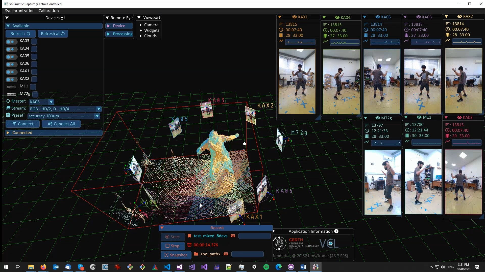

> Moving beyond green screens, expensive, bulky and effort-heavy volumetric setups

___

***Volumetric Capture*** is a multi-sensor (volumetric) capturing system that is:
- Built to use low-cost commodity hardware
- Quick to setup by offering automatic and scalable sensor connectivity
- Easy to deploy due to a markerless and facile volumetric calibration
- Documented across its multiple aspects, deployment, setup, harware, etc.

# Summary
The toolset is designed as a distributed system where a number of processing units each manage and collect data from a single sensor using a headless application, an **Eye** (see [Remote Eyes](docs/eyes.md)). 
A set of sensors is orchestrated by a centralized UI application, **VolCap** (see [Volumetric Capture](docs/volcap.md)), that is also the delivery point of the connected sensor streams.
Communication is handled by a broker, typically co-hosted with the controlling application, although not necessary.

More specifically, its technical offerings are:
- Efficient, scalable and low-resource multi-stream live sensor data acquisition and recording (see [Data Acquisition](docs/acquisition.md))
- Integration (and mixing) of Kinect 4 Azure and Intel RealSense 2.0 D415 devices (see [Hardware Setup](docs/hardware/hardware.md) and [Configuration](docs/configure.md))
- Combined hardware (device-specific) and software (IEEE 1588 PTP) multi-stream synchronization (see [Synchronization](docs/synchronization.md))
- Data-driven and global optimized volumetric alignment (see [Calibration](docs/calibration/calibration.md))

For instructions on how to install it please see [Software Setup](docs/software.md).



# Usage
It has been used in various research and development activities:
- Live tele-presence in Augmented VR or Mixed/Augmented Reality settings
- Performance Capture
- Free Viewpoint Video (FVV)
- Immersive Applications (i.e. events and/or gaming)
- Motion Capture

### Showcase
If you successfully deploy and use this system in your activities, we would love to hear from you, please reach out:
- via [GitHub issue](https://github.com/VCL3D/VolumetricCapture/issues), or
- through this [form](https://forms.gle/DxA3yiumbbdwEcPSA), or,
- via directly contacting the [team](#developers),

so we can add you to our [showcase](docs/showcase).

### Citation
If you use this system in academic work please consider citing:
```java
@inproceedings{sterzentsenko2018low,
  title={A low-cost, flexible and portable volumetric capturing system},
  author={Sterzentsenko, Vladimiros and Karakottas, Antonis and Papachristou, Alexandros and Zioulis, Nikolaos and Doumanoglou, Alexandros and Zarpalas, Dimitrios and Daras, Petros},
  booktitle={2018 14th International Conference on Signal-Image Technology \& Internet-Based Systems (SITIS)},
  pages={200--207},
  year={2018},
  organization={IEEE}
}
```

# Developers

- *Lead*: [Nikolaos](github.com/zokin) [Zioulis](github.com/zuru)

- *Design & Architecture*: [Nikolaos](github.com/zokin) [Zioulis](github.com/zuru) , [Alexandros Doumanoglou](github.com/alexd314) 
- *Core*: [Nikolaos](github.com/zokin) [Zioulis](github.com/zuru) , [Vladimiros Sterzentsenko](github.com/vladster) , [Antonis Karakottas](github.com/ankarako) , [Alexandros Doumanoglou](github.com/alexd314) 
- *Contributors*: [Anargyros Chatzitofis](https://github.com/tofis) , [Leonidas Saroglou](https://github.com/leosarog) 
- *Hardware*: [Antonis Karakottas](https://github.com/ankarako) 

# Disclaimers

## Caveats
**We currently only ship _binaries_ for the Windows platform, supporting Windows 10.**
{: .label .label-yellow }

**There are no guarantees for the system's functionalities and operational status.**
{: .label .label-yellow }

**The software is being developed to support research workflows which are continuously evoling, therefore, backwards compatibility will often break.**
{: .label .label-yellow }

## Maintenance & Support
The development of this system was made possible through H2020 research and development activities. A result of this project-based funding is that maintaining and providing continuous support is not possible after the project's lifetime. However, while there are no commitments or obligations, the developement team will try to provide support at its own discretion and free time.
{: .label .label-red }
